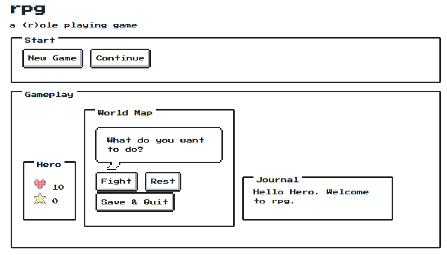

<!-- README.md is generated from README.Rmd. Please edit that file -->
rpg 
=======================================================================

Play a role playing game in the R console.

Installation
------------

``` r
# Install development version from GitHub
devtools::install_github("anthonypileggi/rpg")
```

Example
-------

``` r
library(rpg)

# Create a new player
x <- Player$new("Hero")
x
#> Player: 
#>   Name: Hero
#>   Level: 1
#>   XP: 0
#>   HP: 10/10

# Fight some monsters
x$fight("slime")
#> Hero attacks for 1 damage!
#>  HP reduced by 1 (2 --> 1)
#> slime attacks for 1 damage!
#>  HP reduced by 1 (10 --> 9)
#> Hero attacks for 1 damage!
#>  HP reduced by 1 (1 --> 0)
#> Player Wins!  The slime has been defeated!

x$fight("skeleton")
#> Hero attacks for 1 damage!
#>  HP reduced by 1 (5 --> 4)
#> skeleton attacks for 1 damage!
#>  HP reduced by 1 (9 --> 8)
#> Hero attacks for 1 damage!
#>  HP reduced by 1 (4 --> 3)
#> skeleton attacks for 1 damage!
#>  HP reduced by 1 (8 --> 7)
#> Hero attacks for 1 damage!
#>  HP reduced by 1 (3 --> 2)
#> skeleton attacks for 1 damage!
#>  HP reduced by 1 (7 --> 6)
#> Hero attacks for 1 damage!
#>  HP reduced by 1 (2 --> 1)
#> skeleton attacks for 1 damage!
#>  HP reduced by 1 (6 --> 5)
#> Hero attacks for 1 damage!
#>  HP reduced by 1 (1 --> 0)
#> Player Wins!  The skeleton has been defeated!

# Check your current status
x
#> Player: 
#>   Name: Hero
#>   Level: 1
#>   XP: 0
#>   HP: 5/10

# Rest to heal yourself; if your HP falls to 0 then it's GAME OVER!
x$rest()
#> Recovering 5 HP
x
#> Player: 
#>   Name: Hero
#>   Level: 1
#>   XP: 0
#>   HP: 10/10

# Watch out, it's a giant!
x$fight("giant")
#> Hero attacks for 1 damage!
#>  HP reduced by 1 (10 --> 9)
#> giant attacks for 1 damage!
#>  HP reduced by 1 (10 --> 9)
#> Hero attacks for 1 damage!
#>  HP reduced by 1 (9 --> 8)
#> giant attacks for 1 damage!
#>  HP reduced by 1 (9 --> 8)
#> Hero attacks for 1 damage!
#>  HP reduced by 1 (8 --> 7)
#> giant attacks for 1 damage!
#>  HP reduced by 1 (8 --> 7)
#> Hero attacks for 1 damage!
#>  HP reduced by 1 (7 --> 6)
#> giant attacks for 1 damage!
#>  HP reduced by 1 (7 --> 6)
#> Hero attacks for 1 damage!
#>  HP reduced by 1 (6 --> 5)
#> giant attacks for 1 damage!
#>  HP reduced by 1 (6 --> 5)
#> Hero attacks for 1 damage!
#>  HP reduced by 1 (5 --> 4)
#> giant attacks for 1 damage!
#>  HP reduced by 1 (5 --> 4)
#> Hero attacks for 1 damage!
#>  HP reduced by 1 (4 --> 3)
#> giant attacks for 1 damage!
#>  HP reduced by 1 (4 --> 3)
#> Hero attacks for 1 damage!
#>  HP reduced by 1 (3 --> 2)
#> giant attacks for 1 damage!
#>  HP reduced by 1 (3 --> 2)
#> Hero attacks for 1 damage!
#>  HP reduced by 1 (2 --> 1)
#> giant attacks for 1 damage!
#>  HP reduced by 1 (2 --> 1)
#> Hero attacks for 1 damage!
#>  HP reduced by 1 (1 --> 0)
#> Player Wins!  The giant has been defeated!

# Whew, we did it.  Now we just need to deal with one last slime...
x$fight("slime")
#> Hero attacks for 1 damage!
#>  HP reduced by 1 (2 --> 1)
#> slime attacks for 1 damage!
#>  HP reduced by 1 (1 --> 0)
#> Player Dies!  Game Over!
```

Journal
-------

Access your journal to relive the adventure!

``` r
cat(tail(x$journal))
#> Hero attacks for 1 damage!
#>  Player Wins!  The giant has been defeated!
#>  Hero attacks for 1 damage!
#>  slime attacks for 1 damage!
#>      HP reduced by 1 (1 --> 0)
#>  Player Dies!  Game Over!
```

Bestiary
--------

Check out the full list of monsters you can fight!

``` r
bestiary()
#> # A tibble: 3 x 8
#>   name        hp    mp strength defense speed magic    xp
#>   <chr>    <dbl> <dbl>    <dbl>   <dbl> <dbl> <dbl> <dbl>
#> 1 slime        2     0        1       1     1     1     1
#> 2 skeleton     5     0        1       1     1     1     2
#> 3 giant       10     0        1       1     1     1     3
```

Shiny
-----

I am also working on a shiny version. It is still WIP, but it already looks really neat thanks to the [`nessy`](https://github.com/ColinFay/nessy) package!


